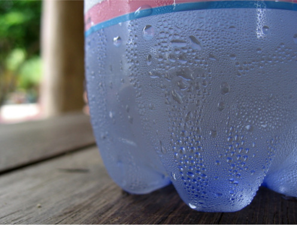

Vlaga ali vlažnost je količina vodne pare v zraku. Vodna para je plinasto stanje vode.

Količina vodene pare v zraku, je odvisna od temperature:
- Višja, kot je temperatura zraka, več vodne pare se lahko sprosti v zraku
- Nižja, kot je temperatura zraka, manj vodne pare se lahko sprosti v zraku

    

Ko vzamete hladilno pločevinko ali steklenico iz hladilnika, se bo na njej hitro nabrala voda. To se zgodi, ker hladna steklenica hladi zrak okoli nje, zaradi česar zrak ne more zadržati vodne pare. Zaradi tega se vodna para, ki je ni mogoče zadržati, spremeni v tekočo vodo. To se imenuje *kondenzacija*. Glede na te podatke moramo nato razumeti, da lahko vlažnost merimo na dva načina:

- **Absolutna** vlažnost je skupna masa vodne pare v določeni prostornini zraka. Temperatura se ne upošteva. Ta meritev se ponavadi izrazi v gramih vode na kubični meter zraka.
- **Relativna vlažnost** pa se izrazi kot odstotek. Za katero koli temperaturo zraka obstaja največja količina vodne pare, ki je lahko v zraku. Relativna vlažnost je odstotek trenutno prisotne vodne pare v primerjavi z največjo možno količino.

To pomeni, da bo enaka količina vodne pare povzročila različne odčitke relativne vlažnosti, odvisno od temperature zraka. Na primer, nizka temperatura zraka lahko povzroči visoko odčitavanje relativne vlage, saj zrak ne more suspendirati veliko več vodne pare. Povečevanje temperature zraka ter ohranjanje enake količine vodne pare bo povzročilo, da se relativna vlažnost spusti, ker se največja količina vodne pare, ki **bi** lahko bila v zraku, poveča.

