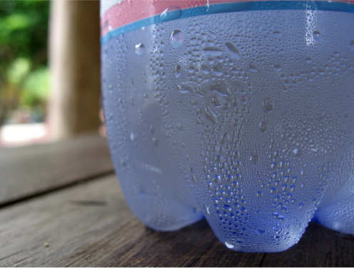

Vochtigheid is de hoeveelheid waterdamp in de lucht. Waterdamp is de gasvormige toestand van water.

De hoeveelheid waterdamp opgenomen in de lucht is afhankelijk van de temperatuur:
- Hoe hoger de luchttemperatuur, hoe meer waterdamp in de lucht opgenomen kan worden
- Hoe lager de luchttemperatuur, hoe minder waterdamp opgenomen kan worden

    

Als je een koude kan of fles uit de koelkast neemt, zal je snel water erop zien verschijnen. Dit gebeurt omdat de koude fles de lucht errond afkoelt, ervoor zorgend dat de lucht minder in staat is om waterdamp op te nemen. Dit zorgt er dan voor dat de waterdamp die niet opgenomen kan worden terug omgezet wordt in vloeibaar water. Dit heet *condensatie*. Dus, nu we dit weten, moeten we vervolgens begrijpen dat er twee manieren zijn waarop we vochtigheid kunnen meten:

- **Absolute** vochtigheid is de totale hoeveelheid waterdamp opgenomen in een bepaalde hoeveelheid lucht. Er wordt geen rekening gehouden met temperatuur. Deze meting wordt meestal uitgedrukt in gram water per kubieke meter lucht.
- **Relative** vochtigheid, daarentegen, wordt uitgedrukt in een percentage. Voor elke opgegeven luchttemperatuur is er een maximum hoeveelheid waterdamp dei in de lucht opgenomen kan worden. Relatieve vochtigheid is het percentage van werkelijk aanwezige waterdamp, vergeleken met de maximum mogelijke hoeveelheid.

Dit betekent dat een gekende hoeveelheid waterdamp zal resulteren in verschillende relatieve vochtigheidsmetingen, afhankelijk van de luchttemperatuur. Bijvoorbeeld, een lage luchttemperatuur kan leiden tot een hoge relatieve vochtigheidsmeting, omdat de lucht niet zo veel waterdamp kan opnemen. De luchttemperatuur verhogen en dezelfde hoeveelheid waterdamp behouden zal ervoor zorgen dat de relatieve vochtigheidsmeting daalt, omdat de maximumhoeveelheid waterdamp die **could** opgenomen worden verhoogd werd.
